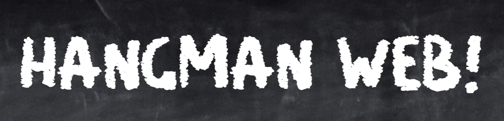

<p align="center">
  
</p>

---

## 📖 Table of contents

1. [**📚 About the project**](#-about-the-project)
2. [**🎥 Demo**](#-demo)
3. [**🚀 How to run the project**](#-how-to-run-the-project)
4. [**💻 Technologies**](#-technologies)
5. [**👥 Credits**](#-credits)

---

## 📚 About the project

This project was developed during the HangMan-Web project, by Ynov Campus. The goal was to create a HangMan game using Go templates.

We decided to add some features to the game, such as:
- 🏆 A leaderboard/Scoreboard
- 👥 A multiplayer mode
- 📜 A History of the games played

We also decided to choose a theme for the game, which is "Chalk and Blackboard", so the game is displayed as if it was written on a blackboard.

The final project repository can be founded [here](https://ytrack.learn.ynov.com/git/lalucas/hangman-web)

---

## 🎥 Demo


---

## 🚀 How to run the project

> [!NOTE]
> A working web hosted version of the project is available at [hangman-web.lucas-astley.live](https://hangman-web.lucas-astley.live/) !

To run the project, you will need to have Go installed on your computer. If you don't have it, you can download it [here](https://golang.org/dl/).

1. Clone the repository:
```bash
git clone https://ytrack.learn.ynov.com/git/lalucas/hangman-web.git
cd hangman-web
go run .\cmd\main.go
```

2. Open your browser and go to `http://localhost:8080/` to play the game.

if you want to play the game in multiplayer mode, you will need to be at least 2 players on the same network. and enter the ip address of the server in the browser.

---

## 💻 Technologies

The project was developed using the following technologies:
- [Go](https://golang.org/)
- [GoHTML](https://pkg.go.dev/html/template)
- [Json](https://pkg.go.dev/encoding/json)

---

## 👥 Credits

This project was developed by:
<br>
<a href="https://github.com/Oiha-dev"></a>
<a href="https://github.com/LucasAstley"></a>

The font used in the project is [Chalkboard](https://www.dafont.com/neat-chalk.font) by [Darrell Flood](https://www.hawtpixel.com).<br>
You can find the background image [here](https://unsplash.com/fr/photos/un-tableau-noir-avec-un-tableau-noir-et-des-crayons-de-couleur-065tsEqQj6Y).
